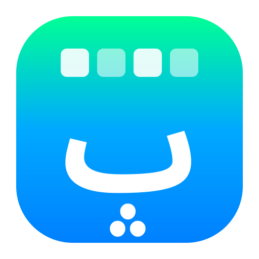

<picture>
  <source media="(prefers-color-scheme: dark)" srcset="data/icons/com.parchlinux.pordle.svg">
  
</picture>

<br clear="all">

پردل یک بازی وردل فارسی برای پارچ لینوکس است که با Rust و GTK4 و libadwaita ساخته شده. هر روز یک کلمه پنج حرفی جدید حدس بزنید و ببینید چند حدس لازم دارید.

Pordle is a Persian Wordle game for Parch Linux built with Rust, GTK4, and libadwaita. Guess a new five letter word every day and see how many guesses you need.

<br>

**بازی در دو حالت**

در حالت روزانه همه کاربران یک کلمه یکسان بر اساس تاریخ دریافت می‌کنند و نتیجه هر روز ذخیره می‌شود. در حالت آزاد کلمات تصادفی برای تمرین و تکرار در اختیار شماست. می‌توانید با صفحه کلید فیزیکی یا صفحه کلید لمسی فارسی داخل برنامه تایپ کنید.

**Two game modes**

Daily mode gives everyone the same word based on the date and saves your result for the day. Practice mode serves random words for unlimited play. Type using either your physical keyboard or the on-screen Persian keyboard.

<br>

**رنگ‌ها**

سبز یعنی حرف در جای درست، زرد یعنی حرف در کلمه هست اما جای آن درست نیست، و قرمز یعنی حرف در کلمه نیست.

**Colors**

Green means the letter is in the right position, yellow means the letter is in the word but in the wrong position, and red means the letter is not in the word.

<br>

**ساخت و نصب**

```
cargo build --release
./target/release/pordle
```

وابستگی‌ها: GTK4، libadwaita، و Rust. کلمات از فایل words.txt در دایرکتوری دیتا یا /usr/share/pordle/words.txt بارگذاری می‌شوند.

**Building**

Dependencies are GTK4, libadwaita, and Rust. Words are loaded from words.txt in the data directory or /usr/share/pordle/words.txt on first run.

<br>

**مجوز**

این پروژه تحت مجوز AGPL-3.0 منتشر شده است.
